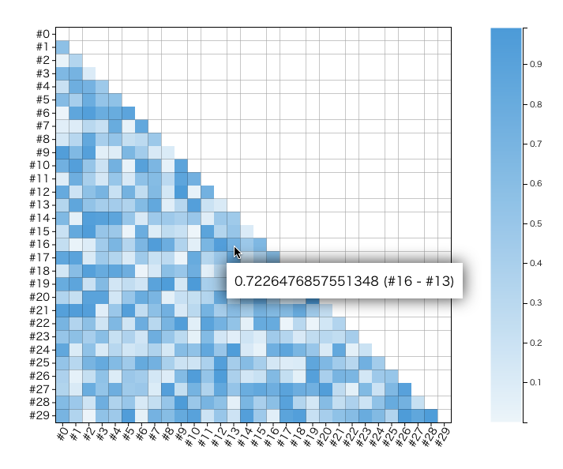

# D3 Correlation Matrix



### Installation

##### CDN
```
<script type="text/javascript" src="https://cdnjs.cloudflare.com/ajax/libs/d3/3.5.17/d3.min.js"></script>
<script src="https://cdn.jsdelivr.net/npm/d3_correlation_matrix@0.0.3/d3.layout.js"></script>
<script src="https://cdn.jsdelivr.net/npm/d3_correlation_matrix@0.0.3/d3.matrix.js"></script>
```

### Quick Start
```
var correlationMatrix = [
  [1, 0.3, 0, 0.8, 0, 0.2, 1, 0.5, 0, 0.75],
  [0.3, 1, 0.5, 0.2, 0.4, 0.3, 0.8, 0.1, 1, 0],
  [0, 0.5, 1, 0.4, 0, 0.9, 0, 0.2, 1, 0.3],
  [0.8, 0.2, 0.4, 1, 0.3, 0.4, 0.1, 1, 0.2, 0.9],
  [0, 0.4, 0, 0.3, 1, 0.1, 0.4, 0, 0.6, 0.7],
  [0.2, 0.3, 0.9, 0.4, 0.1, 1, 0, 0.1, 0.4, 0.1],
  [1, 0.8, 0, 0.1, 0.4, 0, 1, 0.5, 0, 1],
  [0.5, 0.1, 0.2, 1, 0.1, 0, 0.5, 1, 0, 0.4],
  [0, 1, 1, 0.2, 0.6, 0.4, 0, 0, 1, 0.6],
  [0.75, 0, 0.3, 0.9, 0.7, 0.1, 1, 0.4, 0.6, 1]
]

var labels = ['#1', '#2', '#3', '#4', '#5', '#6', '#7', '#8', '#9', '#10']

function tooltip_constructer(labelsData, d, i){
  var row_number = i % labelsData.length
  var column_number =  parseInt(i / labelsData.length)
  if(row_number>=column_number) return null
  return d + ' (' + labelsData[column_number] + ' - ' + labelsData[row_number] + ')'
}

Matrix({
    container : '#the_container',
    width: 500,
    height: 500,
    widthLegend: 100,
    tooltip_canvas_selector: 'body',
    tooltip_constructer: tooltip_constructer,
    data      : correlationMatrix,
    labels    : labels,
    start_color : 'rgb(235, 245, 251)',
    end_color : '#3498db'
})
masking(labels, 'white')
```
